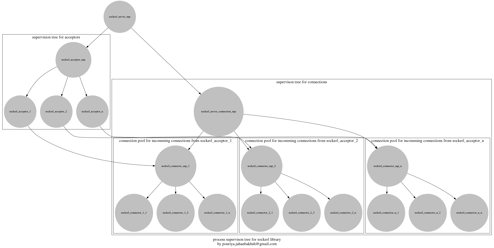

# SockErl
This is advanced Erlang socket library for TCP protocols and provides fast, useful and simple API for implementing server, connector and connector pool.

## Features
* Acceptors and Connectors are not `gen_server`, `gen_fsm`, etc. They have been written as `Special process` and they are blazingly fast.  
* Blocking and non-blocking sockets are supported.  
* SSL is supported too (`ssl` module used), but you can use your own module, you just need to implement `sockerl_transporter` behaviour.  
* Transporter can be changed (for example upgrade normal tcp connection to ssl connection).  
* Simple and useful API.  

All features not listed here :)


##### Download
```sh
~ $ git clone --branch 17.7.3 https://github.com/Pouriya-Jahanbakhsh/sockerl.git
```

##### Use as dependency:
> Reabr3:
```erlang
...
{deps
,[...
 
 {sockerl, "17.7.3"}
 
 ...]}.
...
```

> Rebar:
```erlang
...
{deps
,[...
 
 {sockerl, ".*", {git, "https://github.com/Pouriya-Jahanbakhsh/sockerl.git", {tag, "17.7.3"}}}
 
 ...]}.
...
```

> Mix:
```elixir
...
defp deps do
    [...
    
    {:sockerl, "~> 17.7.3"}
    
    ...]
end
...
```

## Synopsis
I will explain implementing simple echo server, connector and connector pool in order.


### Server


### Non-blocking server (active)
I have to implement `sockerl` behaviour.  
`echo_server.erl`:
```erlang
-module(echo_server).
-behaviour(sockerl).

%% API:
-export([start/1
        ,packet_count/1]).


%% sockerl callbacks:
%% I can implement handle_cast/3, handle_event/3, timeout/2 too.
%% But i don't need them yet.
-export([listen_init/2
        ,connector_init/2
        ,handle_packet/3
        ,handle_disconnect/2
        ,handle_call/4
        ,terminate/3
        ,code_change/3]).


start(Port) ->
    RegisterName = {local, ?MODULE}, %% Optional
    CallbackMod = ?MODULE,
    InitArg = null,
    StartOpts = [],
    sockerl:start_link_server(RegisterName
                             ,CallbackMod
                             ,InitArg
                             ,Port
                             ,StartOpts).


packet_count(Con) ->
    gen_server:call(Con, how_much).


-spec
listen_init(InitArg, ListenSock) ->
    'ok'             |
    {'ok', InitArg2} |
    {'stop', Reason} |
    'ignore'
when
    InitArg :: any(),
    ListenSock :: sockerl_types:socket(),
    InitArg2 :: any(),
    Reason :: any().
%% This function will be called after binding socket to given port.
%% Note that InitArg or InitArg2 will be used as InitArg of 
%%  connection_init/2 for every incoming connection.
listen_init(null, _LSock) ->
    {ok, null2}.


-spec
connector_init(InitArg, ConnectionSock) ->
    'ok'                    | %% your State will be atom 'undefined'
    {'ok', Opts}            |
    'close'                 |
    {'close', Opts}         |
    {'stop', Reason}        |
    {'stop', Reason, Opts}  |
    'ignore'
when
    InitArg :: any(),
    ConnectionSock :: sockerl_types:socket(),
    Opts :: [] | [Opt],
    Opt :: {'state', any()}
         | {'packet', sockerl_types:packet()},
    Reason :: any().
%% Every accepted connection has its own process and state and after 
%%  accepting this function will be called by its process.
%% If returns 'close' or {'close', Opts}, process will close socket 
%%  connection and will exit with reason 'normal'
%% If returns {'stop', ...} , by default entire server will crash. But 
%%  you can control behaviour of 'stop' too.
%% If you use {packet, Pkt}, it will send Pkt in initializing position.
%% I will explain other available options for Opts later.
connector_init(null2, _ConSock) ->
    {ok, [{state, 0}]}.


-spec
handle_packet(Packet, State, Metadata) ->
    'ok'                    |
    {'ok', Opts}            |
    'close'                 |
    {'close', Opts}         |
    {'stop', Reason}        |
    {'stop', Reason, Opts}
when
    Packet :: sockerl_types:packet(),
    State :: any(),
    Metadata :: sockerl_types:metadata(),
    Opts :: [] | [Opt],
    Opt :: {'state', any()}
         | {'packet', sockerl_types:packet()},
    Reason :: any().
%% For every incoming packet from socket, process will execute this 
%%  function with that packet.
%% Don't think about MetaData, i will explain that later.
%% This is echo server which means server will send back every packet.
handle_packet(Pkt, Count = _MyState, _MetaData) ->
    {ok, [{state, Count + 1}, {packet, Pkt}]}.


-spec
handle_call(Request, From, State, Metadata) ->
    'ok'                    |
    {'ok', Opts}            |
    'close'                 |
    {'close', Opts}         |
    {'stop', Reason}        |
    {'stop', Reason, Opts}
when
    Request :: any(),
    From :: {pid(), reference()},
    State :: any(),
    Metadata :: sockerl_types:metadata(),
    Opts :: [] | [Opt],
    Opt :: {'state', any()}
         | {'reply', From, Response}
         | {'packet', sockerl_types:packet()},
    Response :: any(),
    Reason :: any().
%% Note that i don't want to change state (Count) in my call, then i
%%  don't need to return state again.
%% I want to send to caller the number of client packets that it sent.
handle_call(how_much, From, Count, _Metadata) ->
    {ok, [{reply, From, Count}]}.


-spec
handle_disconnect(State, Metadata) ->
    'ok'                    |
    {'ok', Opts}            |
    'close'                 |
    {'close', Opts}         |
    {'stop', Reason}        |
    {'stop', Reason, Opts}
when
    State :: any(),
    Metadata :: sockerl_types:metadata(),
    Opts :: [] | [Opt],
    Opt :: {'state', any()},
    Reason :: any().
%% This function will be called when socket connection closed by remote.
%% Don't use {'packet', Pkt} in return value because socket has been
%%  closed and after this terminate/3 will called.
%% Metadata is an Erlang record containing some data, one of them is
%%  socket.
%% You can use API of sockerl_metadata module for working on Metadata.
handle_disconnect(Count, Metadata) ->
    Sock = sockerl_metadata:get_socket(Metadata),
    io:format("Socket ~p closed connection after sending ~p packets~n"
             ,[Sock, Count]),
    ok.


-spec
terminate(Reason, State, Metadata) ->
    any()
when
    Reason :: any(),
    State :: any(),
    Metadata :: sockerl_types:metadata().
%% Why i should implement handle_disconnect and terminate both?
%% Because you can change reason termination in handle_disconnect when 
%%  remote closed connection.
terminate(_Reason, _State, _Metadata) ->
    ok.


-spec
code_change(OldVsn, State, Extra) ->
    {'ok', NewState}
when
    OldVsn :: any(),
    State :: any(),
    Extra :: any(),
    NewState :: any().
code_change(_, State, _) ->
    {ok, State}.
```
Compile and go to the Erlang shell (You should add path for `echo_server.beam` and `sockerl` and its dependencies):
```erlang
Erlang/OTP 19 [erts-8.2.2] [source-1ca84a4] [64-bit] [smp:4:4] [async-threads:0] [hipe] [kernel-poll:false]

Eshell V8.2.2  (abort with ^G)
1> echo_server:start(8080).
{ok,<0.104.0>}

%% Getting all available server connections:
2> sockerl:get_server_connections(echo_server).
[]
```
Make a `telnet` connection to server (i will use `sockerl` connector instead of this):
```sh
$ telnet 127.0.0.1 8080

Trying 127.0.0.1...
Connected to 127.0.0.1.
Escape character is '^]'.
```
Get server connection again:
```erlang
3> sockerl:get_server_connections(echo_server).
[{#Port<0.7532>,<0.116.0>}]
```
Send some texts in `telnet` connection:
```sh
foo
foo
2
2
3
3
4
4
5
5
```
Server replies after sending every text.  
Check packet count for connection:
```erlang
4> [{_, Con}] = sockerl:get_server_connections(echo_server).
[{#Port<0.7532>,<0.116.0>}]

5> echo_server:packet_count(Con).
5
```
Works perfectly. stop the `telnet` connection and come back to the Erlang shell, what you see?  
```erlang
Socket #Port<0.9341> closed connection after sending 5 packets

...

** exception error: {socket_check_message,[{reason,closed},
                                           {info,"Socket connection closed"},
                                           {transporter,sockerl_tcp_transporter},
                                           {message,{tcp_closed,#Port<0.7532>}}]}
```
Good news is that sockerl has clean debug output for everything.  
Now entire supervision tree of server crashed !  
If you dont want this, you have to choose between these two approachs:
##### 1. Always use `'close'` or `{'close', Opts}` and use it in `handle_disconnect/2` too
Change previous code and rename it to `echo_server2.erl`(Just change `handle_disconnect/2`):
```erlang
handle_disconnect(Count, Metadata) ->
	Sock = sockerl_metadata:get_socket(Metadata),
	io:format("Socket ~p closed connection after sending ~p packets~n"
	         ,[Sock, Count]),
	close.
```
Compile and go the Erlang shell and run the server, then open new `telnet` connection:
```erlang
Erlang/OTP 19 [erts-8.2.2] [source-1ca84a4] [64-bit] [smp:4:4] [async-threads:0] [hipe] [kernel-poll:false]

Eshell V8.2.2  (abort with ^G)
1> echo_server2:start(8888).
{ok,<0.109.0>}
```
```sh
$ telnet 127.0.0.1 8888

Trying 127.0.0.1...
Connected to 127.0.0.1.
Escape character is '^]'.
```
Sockerl has some useful API for interacting with connections:
```erlang
2> [{_, Con}] = sockerl:get_server_connections(echo_server2).
[{#Port<0.9339>,<0.116.0>}]

%% Sending synchronously, You will get reply after sending packet.
3> sockerl:send_sync(Con, "first line\n").
ok

%% Sending asynchronously
4> sockerl:send_async(Con, <<"second line\n">>).
ok
```
See `telnet` terminal:
```sh
first line
second line
```
Stop `telnet` connection again and see the Erlang shell:
```erlang
Socket #Port<0.9341> closed connection after sending 0 packets

=ERROR REPORT==== 30-Jun-2017::23:52:44 ===
** Sockerl connector "<0.116.0>" terminating 
** Reason for termination == "normal"
** State == "0"
```
Server is up !

#### 2. Use your own childspec plan for your connections:
I used my own supervisor library ([**Director**](https://github.com/Pouriya-Jahanbakhsh/director)) istead of OTP/supervisor module, because it's more flexible.  
You can define `{'connector_childspec_plan', YourPlan}` in `Opts` for doing this.  
Default plan is (`[fun sockerl_utils:default_connector_plan_fun/2]`):
```erlang
default_connector_plan_fun(normal, _RestartCount) ->
    delete;
default_connector_plan_fun(_Reason, _RestartCount) ->
    stop.
```
If connection crashed with reason `normal`, supervisor deletes childspec from its children and if connection crashed with any other reason, supervisor will crash with that reason.  
How much time you want to run this plan?  
You can define `{'connector_childspec_count', Int}` in `Opts`. Default is 1.  
For example:
```erlang
start(Port) ->
	sockerl:start_link_server(?MODULE
	                         ,my_init_arg
	                         ,Port
	                         ,[{connector_childspec_plan, [fun plan/2]}
	                          ,{connector_childspec_count, 5}]).


plan(known_reason, RestartCount) when RestartCount < 5 ->
	{restart, 1000};
plan(_Reason, 5) ->
	stop;
plan(Reason, _RestartCount) ->
	{stop, {unknwon_reason, Reason}}.
```
In above code, if connection crashes with reason `'known_reason'` four times, every time supervisor will restart it after 1000 mili-seconds and if it crashes with other reasons, supervisor will crash with reason `{'unknown_reason', OtherReason}` and finally after 5th crash supervisor will delete it from supervison tree !  
for more information about plan and count see [**Director**](https://github.com/Pouriya-Jahanbakhsh/director)

### What is other possible values for `StartOpts`?
```erlang
%% ---------------------------------------------------------------------
%% Only for server implementation:

%% Number of connection acceptors.
%% Default is 1.
{acceptor_count, non_neg_integer()}

%% If you don't want to start accepting connections after binding socket,
%%  you can set this to 'sleep' and call sockerl:wakeup_acceptors/1 for
%%  start accepting.
%% Default is 'accept'
{acceptor_mode, 'accept' | 'sleep'}

%% Acceptor Debug. Can be standard Erlang/OTP 'sys' debug options.
%% Default is [].
{acceptor_debug, [sys:dbg_opt()]}

%% ---------------------------------------------------------------------
%% Only for server and connector-pool implementation:

%% Plan for connection childspec.
%% Default is [fun sockerl_utils:default_connection_plan_fun/2].
{connector_childspec_plan, list()}

%% Count of running childspec plan
%% Default is 1.
{connector_childspec_count, non_neg_integer()}

%% ---------------------------------------------------------------------
%% Only for connector-pool implementation:

%% Number of connectors:
%% Default is 1.
{connector_count, non_neg_integer()}

%% ---------------------------------------------------------------------
%% For server, connector_pool and connector:

%% Transporter is a module for interacting with socket.
%% Sockerl comes with 'sockerl_tcp_transporter' and 
%%  'sockerl_ssl_transporter' but you can write your own module by 
%%  implementing 'sockerl_transporter' behaviour.
%% Default is 'sockerl_tcp_transporter'.
{transporter, module()}

%% Connector debug. Can be standard Erlang/OTP 'sys' debug options.
%% Default is [].
{connector_debug, [sys:dbg_opt()]}

%% You can specify other options, for example if you transporter module 
%%  needs its options.
%% Sockerl transporters options:
{socket_options, list()}
%% You can use all 'ssl' and 'gen_tcp' options except of {'active', 'once'}
```

### Blocking server (passive)
`reverse_echo_server.erl`:
```erlang
-module(reverse_echo_server).
-behaviour(sockerl).

%% API:
-export([start/1
        ,print_buffer/1
        ,clean/1]).


%% sockerl callbacks:
-export([listen_init/2
        ,connector_init/2
        ,handle_packet/3
        ,handle_disconnect/2
        ,handle_call/4
        ,handle_cast/3
        ,terminate/3
        ,code_change/3
        ,timeout/2
        ,srtimeout/2]).


start(Port) ->
    RegisterName = {local, ?MODULE}, %% Optional
    CallbackMod = ?MODULE,
    InitArg = null,

    StartOpts = [{acceptor_count, 3}
                ,{acceptor_mode, sleep}
                ,{acceptor_debug, [trace]}

                ,{connector_debug, [trace]}

                ,{socket_options, [{active, false}, binary]}],

    sockerl:start_link_server(RegisterName
                             ,CallbackMod
                             ,InitArg
                             ,Port
                             ,StartOpts).


print_buffer(Con) ->
    gen_server:call(Con, print_buffer).


clean(Con) ->
    gen_server:cast(Con, clean).


listen_init(null, _LSock) ->
    ok.


%% In passive mode: 
%% When process is waiting for socket packet, it can't receive Erlang messages.
%% When process is waiting for Erlang message, it can't receive socket packets.
%% So i need to define timeout for Erlang receive and socket receive.
%% Use {'timeout', timeout()} for Erlang receive, after timeout if
%%  process did not get message, callback 'timeout/2' will be called.
%% Use {'srtimeout', timeout()} (SRTimeout: Socket Receive Timeout) for
%%  socket receive, after timeout if process did not get packet,
%%  callback 'srtimeout/2' will be called.
%% In passive mode if you want to read for example 4 bytes from socket,
%%  you can define {'length', positive_integer()} in return of every
%%  callback.
%% If you want to use your previous length, timeout or srtimeout value
%%  for increasing or decrasing, etc, dont put it in your state,
%%  Metadata has them.
%% #sockerl_metadata{socket = Sock
%%                  ,timeout = Timeout
%%                  ,srtimeout = SRTimeout
%%                  ,length = Len
%%                  ,transporter = TrMod
%%                  ,options = Opts}
%% Just use sockerl_metadata API.
connector_init(null, _ConSock) ->
    {ok, [{state, <<"">>}, {timeout, 1}, {srtimeout, 1}]}.


handle_packet(Pkt, Buff, _MetaData) ->
    {ok, [{packet, bin_rev(Pkt)}, {state, <<Buff/binary, Pkt/binary>>}]}.


handle_call(print_buffer, From, Buff, _Metadata) ->
    io:format("Buffer: ~p~n", [Buff]),
    {ok, [{reply, From, ok}]}.


-spec
handle_cast(Cast, State, Metadata) ->
    'ok'                    |
    {'ok', Opts}            |
    'close'                 |
    {'close', Opts}         |
    {'stop', Reason}        |
    {'stop', Reason, Opts}
when
    Cast :: any(),
    State :: any(),
    Metadata ::  sockerl_types:metadata(),
    Opts :: [] | [Opt],
    Opt :: {'state', any()}
         | {'packet', sockerl_types:packet()}
         | {'timeout', timeout()}
         | {'srtimeout', timeout()}
         | {'length', sockerl_types:length()},
    Reason :: any().
handle_cast(clean, _Buff, _Metadata) ->
    {ok, [{state, <<"">>}]}.


handle_disconnect(_Buff, _Metadata) ->
    ok.


terminate(_Reason, _State, _Metadata) ->
    ok.


code_change(_, State, _) ->
    {ok, State}.


-spec
timeout(State, Metadata) ->
    'ok'                    |
    {'ok', Opts}            |
    'close'                 |
    {'close', Opts}         |
    {'stop', Reason}        |
    {'stop', Reason, Opts}
when
    State :: any(),
    Metadata ::  sockerl_types:metadata(),
    Opts :: [] | [Opt],
    Opt :: {'state', any()}
         | {'packet', sockerl_types:packet()}
         | {'timeout', timeout()}
         | {'srtimeout', timeout()}
         | {'length', sockerl_types:length()},
    Reason :: any().
timeout(_Buff, _Metadata) ->
    ok.


-spec
srtimeout(State, Metadata) ->
    'ok'                    |
    {'ok', Opts}            |
    'close'                 |
    {'close', Opts}         |
    {'stop', Reason}        |
    {'stop', Reason, Opts}
when
    State :: any(),
    Metadata ::  sockerl_types:metadata(),
    Opts :: [] | [Opt],
    Opt :: {'state', any()}
         | {'packet', sockerl_types:packet()}
         | {'timeout', timeout()}
         | {'srtimeout', timeout()}
         | {'length', sockerl_types:length()},
    Reason :: any().
srtimeout(_Buff, _Metadata) ->
    ok.


%% Reverses binary
bin_rev(Bin) ->
    Size = erlang:size(Bin)*8,
    <<X:Size/integer-little>> = Bin,
    <<X:Size/integer-big>>.
```
Compile and run:
```erlang
1> reverse_echo_server:start(1995).
*DBG* Sockerl acceptor "<0.110.0>" started for listen socket "#Port<0.7500>" with options:
        transporter module: 'sockerl_tcp_transporter'
        pool pid: <0.109.0>
        mode: 'sleep'
*DBG* Sockerl acceptor "<0.111.0>" started for listen socket "#Port<0.7500>" with options:
        transporter module: 'sockerl_tcp_transporter'
        pool pid: <0.108.0>
        mode: 'sleep'
*DBG* Sockerl acceptor "<0.112.0>" started for listen socket "#Port<0.7500>" with options:
        transporter module: 'sockerl_tcp_transporter'
        pool pid: <0.107.0>
        mode: 'sleep'
{ok,<0.104.0>}

%% Turn acceptors to accept mode
2> sockerl:wakeup_acceptors(reverse_echo_server).
*DBG* Sockerl acceptor "<0.110.0>" got request "accept" from "<0.106.0>"
*DBG* Sockerl acceptor "<0.110.0>" changed mod to "accept"
*DBG* Sockerl acceptor "<0.110.0>" sent message "ok" to "<0.106.0>" 
*DBG* Sockerl acceptor "<0.112.0>" got request "accept" from "<0.106.0>"
*DBG* Sockerl acceptor "<0.112.0>" changed mod to "accept"
*DBG* Sockerl acceptor "<0.112.0>" sent message "ok" to "<0.106.0>" 
*DBG* Sockerl acceptor "<0.111.0>" got request "accept" from "<0.106.0>"
*DBG* Sockerl acceptor "<0.111.0>" changed mod to "accept"
*DBG* Sockerl acceptor "<0.111.0>" sent message "ok" to "<0.106.0>" 
ok
```
Make `telnet` connection:
```shell
$ telnet 127.0.0.1 1995
Trying 127.0.0.1...
Connected to 127.0.0.1.
Escape character is '^]'.
```
See debug output of Sockerl:
```erlang
*DBG* Sockerl acceptor "<0.110.0>" accepted socket "#Port<0.7536>"
*DBG* Sockerl acceptor "<0.110.0>" gave socket "#Port<0.7536>" to connection handler "<0.123.0>"

3> [{_, C}] = sockerl:get_server_connections(reverse_echo_server).
[{#Port<0.7536>,<0.123.0>}]
```
Send `123` and then `456` from `telnet` and see Sockerl debug output
```erlang
*DBG* Sockerl connector "<0.118.0>" got packet <<"123\r\n">>
*DBG* Sockerl connector "<0.118.0>" sent packet <<"\n\r321">>
*DBG* Sockerl connector "<0.118.0>" got packet <<"456\r\n">>
*DBG* Sockerl connector "<0.118.0>" sent packet <<"\n\r654">>
```
Test API:
```erlang
4> reverse_echo_server:print_buffer(C).  
*DBG* Sockerl connector "<0.123.0>" got call "print_buffer" from "<0.106.0>" with tag "#Ref<0.0.1.17>"
Buffer: <<"123\r\n456\r\n">>
*DBG* Sockerl connector "<0.123.0>" sent "ok" to "<0.106.0>" with tag "#Ref<0.0.1.17>"
ok

5> reverse_echo_server:clean(C).         
ok
*DBG* Sockerl connector "<0.123.0>" got cast "clean"

6> reverse_echo_server:print_buffer(C).
*DBG* Sockerl connector "<0.123.0>" got call "print_buffer" from "<0.106.0>" with tag "#Ref<0.0.1.31>"
Buffer: <<>>
*DBG* Sockerl connector "<0.123.0>" sent "ok" to "<0.106.0>" with tag "#Ref<0.0.1.31>"
ok
```
See debug output of send API:
```erlang
7> sockerl:send_sync(C, "foo").
*DBG* Sockerl connector "<0.123.0>" got synchronous request for sending packet "foo" from "<0.106.0>" with tag "#Ref<0.0.1.43>"
*DBG* Sockerl connector "<0.123.0>" sent packet "foo"
*DBG* Sockerl connector "<0.123.0>" sent "ok" to "<0.106.0>" with tag "#Ref<0.0.1.43>"
ok

8> sockerl:send_async(C, <<"bar">>).
*DBG* Sockerl connector "<0.123.0>" got asynchronous request for sending packet <<"bar">>
ok
*DBG* Sockerl connector "<0.123.0>" sent packet <<"bar">>
```
Close connection from server:
```erlang
9> sockerl:stop_connector(C).
ok 
=ERROR REPORT==== 1-Jul-2017::05:30:32 ===
** Sockerl connector "<0.123.0>" terminating 
** Reason for termination == "normal"
** State == "<<>>"

10> sockerl:get_server_connections(reverse_echo_server).
[]
```
Now stop entire server without crashing yourself:
```erlang
11> Me = self().
<0.106.0>

12> sockerl:stop_server(reverse_echo_server).
%% Some debug outputs about server termination
ok

13> Me == self().
true
```
If you want to send some data to remote connection before terminating, the good idea is to getting socket from `Metadata` in `terminate/3` callback and send packet through socket:
```erlang
terminate(something_goes_wrong=_Reason, _State, Metadata) ->
	Sock = sockerl_metadata:get_socket(Metadata),
	TrMod = sockerl_metadata:get_transporter(Metadata),
	Opts = sockerl_metadata:get_options(Metadata),
	sockerl_socket:send(TrMod, Sock, <<"bye">>, Opts),
	ok.
```


# Connector
Connector is like server implementation, except that i dont need `listen_init/2` function.  
`check_echo_server2.erl` is a Connector that sends a packet to our `echo_server2` after spending a few seconds!
```erlang
-module(check_echo_server2).
-behaviour(sockerl).

-export([start_link/2
        ,connector_init/2
        ,handle_packet/3
        ,timeout/2
        ,handle_disconnect/2
        ,terminate/3
        ,code_change/3]).


start_link(Port, Sec) ->
    Host = "127.0.0.1",
    sockerl:start_link_connector(?MODULE
                                ,Sec
                                ,Host
                                ,Port
                                ,[{connector_debug, [trace]}]).


connector_init(Sec, _Sock) ->
    %% I want to send packet after spending Sec
    %% I will do this in timeout/2
    %% I don't specify {state, _}, my state will be atom 'undefined'
    {ok, [{timeout, Sec * 1000}]}.


handle_packet(_Packet, undefined=_State, SMD) -> % SMD: Sockerl MetaData
    %% Echo server replies my packet
    %% I want to send next packet after spending previous timeout+1
    %% I will do this in timeout/2 too
    {ok, [{timeout, sockerl_metadata:get_timeout(SMD) + 1000}]}.


handle_disconnect(undefined = _State, _SMD) ->
    %% Will exit with reason 'closed_by_remote' if server closes
    %%  connection
    {stop, closed_by_remote}.


timeout(undefined = _State, _SMD) ->
    %% I will send timestamp (in seconds) to server
    {Me, S, _Mi} = os:timestamp(),
    TSBin = erlang:integer_to_binary((Me * 1000000) + S),
    %% I don't change 'timeout' value, process keeps its last value and
    %%  after sending packet if server replies, i will change it (add 1
    %%  second to it) and if server doesn't reply, after that timeout
    %%  This function will called again.
    {ok, [{packet, TSBin}]}.


terminate(_Reason, undefined = _State, _SMD) ->
    ok.


code_change(_OldVsn, State, _Extra) ->
    {ok, State}.
```
Before starting server, try connecting to it and see the clean error information:
```erlang
Erlang/OTP 19 [erts-8.3] [source-d5c06c6] [64-bit] [smp:8:8] [async-threads:0] [hipe] [kernel-poll:false]

Eshell V8.3  (abort with ^G)
1> check_echo_server2:start_link(8080, 1).
** exception exit: {socket_connect,[{reason,econnrefused},
                                    {info,"connection refused"},
                                    {transporter,sockerl_tcp_transporter},
                                    {host,"127.0.0.1"},
                                    {port,8080},
                                    {options,[{connector_debug,[trace]}]}]}
```
Start `echo_server2` in other terminal:
```erlang
Erlang/OTP 19 [erts-8.3] [source-d5c06c6] [64-bit] [smp:8:8] [async-threads:0] [hipe] [kernel-poll:false]

Eshell V8.3  (abort with ^G)
1> echo_server2:start(8080).
{ok,<0.178.0>}
```
Reconnect the client:
```erlang
2> check_echo_server2:start_link(8080, 1).
{ok,<0.278.0>}
*DBG* Sockerl connector "<0.278.0>" sent packet <<"1499083529">>
*DBG* Sockerl connector "<0.278.0>" got packet "1499083529"

*DBG* Sockerl connector "<0.278.0>" sent packet <<"1499083531">>
*DBG* Sockerl connector "<0.278.0>" got packet "1499083531"

*DBG* Sockerl connector "<0.278.0>" sent packet <<"1499083534">>
*DBG* Sockerl connector "<0.278.0>" got packet "1499083534"

*DBG* Sockerl connector "<0.278.0>" sent packet <<"1499083538">>
*DBG* Sockerl connector "<0.278.0>" got packet "1499083538"

*DBG* Sockerl connector "<0.278.0>" sent packet <<"1499083543">>
*DBG* Sockerl connector "<0.278.0>" got packet "1499083543"

*DBG* Sockerl connector "<0.278.0>" sent packet <<"1499083549">>
*DBG* Sockerl connector "<0.278.0>" got packet "1499083549"
...
```
Close connection in server:
```erlang
2> [{_,Con}] = sockerl:get_server_connections(echo_server2).
[{#Port<0.40773>,<0.185.0>}]

3> sockerl:stop_connector(Con).
ok
 
=ERROR REPORT==== 3-Jul-2017::16:37:39 ===
** Sockerl connector "<0.185.0>" terminating 
** Reason for termination == "normal"
** State == "15"
```
Then client process should exit with reason `'closed_by_remote'`:
```erlang
...
*DBG* Sockerl connector "<0.278.0>" sent packet <<"1499083648">>
*DBG* Sockerl connector "<0.278.0>" got packet "1499083648"
** exception error: closed_by_remote

=ERROR REPORT==== 3-Jul-2017::16:37:39 ===
** Sockerl connector "<0.278.0>" terminating 
** Reason for termination == "closed_by_remote"
** State == "undefined"
```

# Connector pool
Just copy `check_echo_server2.erl` code to new file named `pool_check_echo_server2.erl` and change the `start_link/2` function:
```erlang
...

start_link(Port, Sec) ->
    Host = "127.0.0.1",
    sockerl:start_link_connector_pool(?MODULE
                                     ,Sec
                                     ,Host
                                     ,Port
                                     ,[{connector_count, 5} %% 5 connections
                                      ,{connector_debug, [trace]}]).
...
```
Test the code (i will start with 10 seconds because i want to check some API in shell):
```erlang
Erlang/OTP 19 [erts-8.3] [source-d5c06c6] [64-bit] [smp:8:8] [async-threads:0] [hipe] [kernel-poll:false]

Eshell V8.3  (abort with ^G)
1> {ok, Pool} = pool_check_echo_server2:start_link(8080, 10).
{ok,<0.178.0>}

*DBG* Sockerl connector "<0.179.0>" sent packet <<"1499084520">>
*DBG* Sockerl connector "<0.182.0>" sent packet <<"1499084520">>
*DBG* Sockerl connector "<0.183.0>" sent packet <<"1499084520">>
*DBG* Sockerl connector "<0.184.0>" sent packet <<"1499084520">>
*DBG* Sockerl connector "<0.185.0>" sent packet <<"1499084520">>

*DBG* Sockerl connector "<0.179.0>" got packet "1499084520"
*DBG* Sockerl connector "<0.182.0>" got packet "1499084520"
*DBG* Sockerl connector "<0.183.0>" got packet "1499084520"
*DBG* Sockerl connector "<0.184.0>" got packet "1499084520"
*DBG* Sockerl connector "<0.185.0>" got packet "1499084520"

2> sockerl:get_pool_connections(Pool).
[{1,<0.179.0>},
 {3,<0.183.0>},
 {4,<0.184.0>},
 {2,<0.182.0>},
 {5,<0.185.0>}]

*DBG* Sockerl connector "<0.179.0>" sent packet <<"1499084531">>
*DBG* Sockerl connector "<0.182.0>" sent packet <<"1499084531">>
*DBG* Sockerl connector "<0.183.0>" sent packet <<"1499084531">>
*DBG* Sockerl connector "<0.184.0>" sent packet <<"1499084531">>
*DBG* Sockerl connector "<0.185.0>" sent packet <<"1499084531">>

*DBG* Sockerl connector "<0.179.0>" got packet "1499084531"
*DBG* Sockerl connector "<0.182.0>" got packet "1499084531"
*DBG* Sockerl connector "<0.183.0>" got packet "1499084531"
*DBG* Sockerl connector "<0.184.0>" got packet "1499084531"
*DBG* Sockerl connector "<0.185.0>" got packet "1499084531"

3> [{_, C}|_] = sockerl:get_pool_connections(Pool), sockerl:send_sync(C, <<"foo">>).
*DBG* Sockerl connector "<0.179.0>" got synchronous request for sending packet <<"foo">> from "<0.175.0>" with tag "#Ref<0.0.2.2356>"
*DBG* Sockerl connector "<0.179.0>" sent packet <<"foo">>
*DBG* Sockerl connector "<0.179.0>" sent "ok" to "<0.175.0>" with tag "#Ref<0.0.2.2356>"
*DBG* Sockerl connector "<0.179.0>" got packet "foo"

*DBG* Sockerl connector "<0.179.0>" sent packet <<"1499084543">>
*DBG* Sockerl connector "<0.182.0>" sent packet <<"1499084543">>
*DBG* Sockerl connector "<0.183.0>" sent packet <<"1499084543">>
*DBG* Sockerl connector "<0.184.0>" sent packet <<"1499084543">>
*DBG* Sockerl connector "<0.185.0>" sent packet <<"1499084543">>

*DBG* Sockerl connector "<0.179.0>" got packet "1499084543"
*DBG* Sockerl connector "<0.182.0>" got packet "1499084543"
*DBG* Sockerl connector "<0.183.0>" got packet "1499084543"
*DBG* Sockerl connector "<0.184.0>" got packet "1499084543"
*DBG* Sockerl connector "<0.185.0>" got packet "1499084543"
```

You can change the socket and transporter module by specifying them in return value of callbacks (For example for upgrading tcp to ssl).  
For more information see the code.

### License
`BSD 3-Clause`

### Links
[**GitHub**](https://github.com/Pouriya-Jahanbakhsh/sockerl)  
This documentation is available in [**http://docs.codefather.org/sockerl**](http://docs.codefather.org/sockerl)
